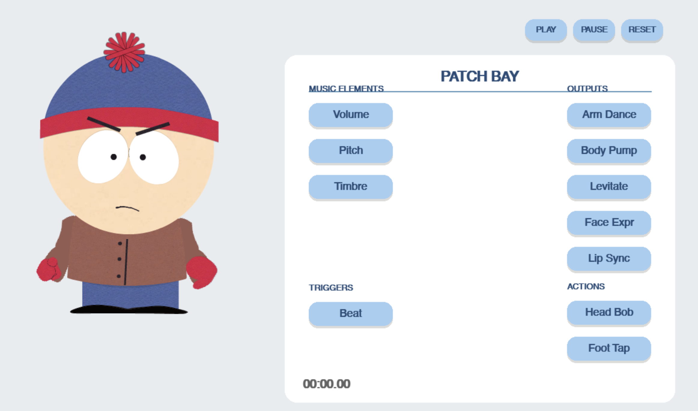

# Music-Driven 2D Avatar 

A Python-based interactive system that animates a 2D South Park-style character using real-time music analysis. 

 

## Key Features

*   **Modular Binding Engine**: Decoupled architecture allowing Many-to-Many mapping between audio signals and animation effectors.
*   **Interactive Patch Bay UI**: Apple-style modern UI for visually connecting inputs (Pitch, Volume, Beat) to outputs (Arm Dance, Lip Sync, etc.).
*   **Hierarchical Bone System**: Custom 2D skeletal rig supporting parent-child transformations.
*   **Advanced Signal Processing**: Uses `Librosa` for feature extraction with custom smoothing and normalization algorithms.

## Tech Stack

*   **Python 3.9+**
*   **Pygame** (Rendering & UI)
*   **Librosa** (Audio Analysis)
*   **Numpy** (Math & Signal Processing)

## 📂 Project Structure

```text
src/
├── analysis.py          # Audio feature extraction (Generates JSON)
├── character/           
│   └── character_rig.py # Bone setup & Asset loading
├── core/                
│   └── bone_system.py   # Skeletal math logic
├── engine/              # [Core Engine]
│   ├── binder.py        # Manages connections
│   ├── effectors.py     # Animation logic (ArmDancer, FootTapper...)
│   └── signals.py       # Data stream handlers
└── ui_components.py     # Custom UI widgets
main.py                  # Entry point
```

## How to Run

1.  **Install Dependencies**:
    ```bash
    pip install pygame librosa numpy
    ```

2.  **Analyze Audio** (First time only):
    *   Place your audio file in `assets/audio/test2.wav`.
    *   Run the analysis script to generate the data cache:
    ```bash
    python src/analysis.py
    ```

3.  **Launch the App**:
    ```bash
    python main.py
    ```

## Controls

*   **Left Panel (Inputs)**: Click to select a music feature (Volume, Pitch, Beat...).
*   **Right Panel (Outputs)**: Click to connect the selected feature to an animation (Arm Dance, Face Expr...).
*   **Play/Pause**: Top right controls.

